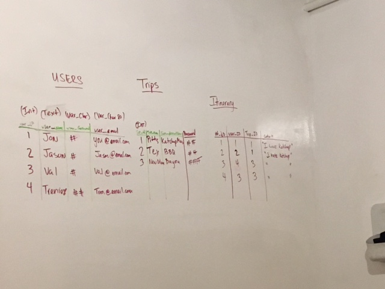
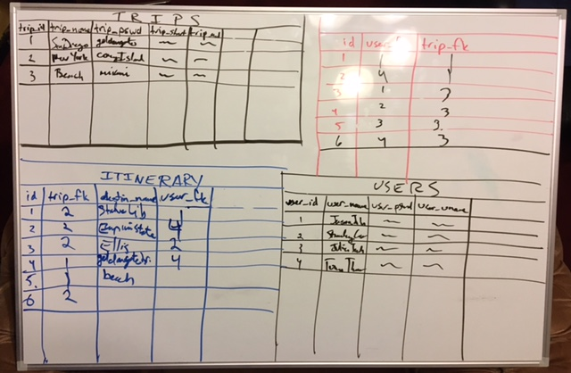
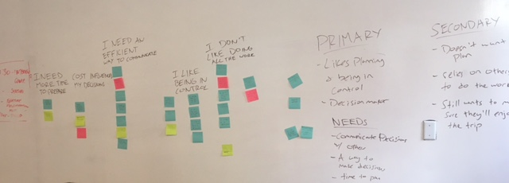

*"Group travelers need a centralized place to communicate, plan, and because planning a trip can become a disorganized process."* 


*_Statement:_*
>Travello was designed to facilitate the organizing and logging of group trips. We have seen that popular travel apps are focused on the individual and the logistics to the exclusion of the social. This forces travelers to utilize multiple platforms to organize, record, and collaborate on their group adventures which leads to a disjointed overall experience. While group email threads, Slack, and speadsheets offer a centralized location, Travello offers travelers an opportunity to divorce themselves from everyday-use apps. Our target demographic are people looking for travel ideas/inspiration, backpackers, and friend groups from different locations on the map.

*_Lessons learned:_* 
>We were way too ambitious with the double authentication. It was difficult enough with single authentication debugging and. We pivoted to a true MVP and reframed the user experience to something less exclusive. 

*_Debugging:_*
>_http_server.js:192 throw new RangeError(`Invalid status code: ${statusCode}`);

*_Bonuses to consider for the future:_*
- Google API call for the location 
- Avatar for individual users
- Double auth
- Chat app







Technologies:
Node.js, Express.js, Passport, Postgres, Sequelize, Javascript, jQuery, EJS, CSS, SASS, Materialize

Code example wins/learns: 

While the query below works in theory (and in Postico) we weren't able to get the logic functioning in our app. Nontheless, it was a great realization that a query could include a table that doesn't exist yet in the query. 

```SELECT  Trips.id, Trips.description
FROM USER JOIN Joinstable ON user.id=Jointable.userid
JOIN Trips ON Jointable.tripid=Trips.id;
WHERE user.username = :id
replacements = { id: req.user.username }```

SASS has proven pretty useful. Nesting is a great time saver, and helped keep the code clean, DRY, and organized. We didn't need to give everything different classes or ids. We just had to nest the child into the parent and everything became relative.


```.itinform {
    font-family: $courier;
    margin-left: 25em;
      label {
          font-size: 20pt;
          color: black;
          text-align: center;
              textarea {
                  width: 50%;
                  display: block;
                  border: 1px solid #9e9e9e;
                  height: 7em;
                  background-color: rgba(255, 255, 255, 0.32);
        }
    }
}```

Partials are our friends. And so is conditional logic. 

```<%
  var url;
  var text;
  if (isLoggedIn === true) {
    text = 'LOGOUT';
    url = '/auth/logout';
  }
  else {
    text = 'LOGIN';
    url = "/auth/login";
  }
%>```
